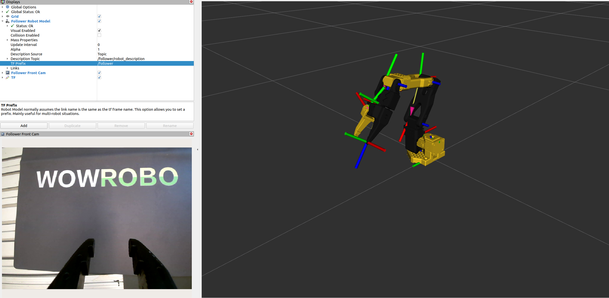

<div align="center">
  <h1>so101_ros2</h1>
  <p>ROS 2 integration for the Lerobot SO101 manipulator.</p>
  <p>
    <a href="docs/index.rst"></a>
    <a href="LICENSE"></a>
    <a href="https://www.python.org/"></a>
    <a href="https://docs.ros.org/en/humble/Installation.html"></a>
    <a href="https://huggingface.co/docs/lerobot/"></a>
    <a href="https://developer.nvidia.com/isaac-sim"></a>
  </p>
</div>

---

## Overview

This workspace contains several packages that provide description files, controllers
and ROS 2 integrations for the SO101 arm. The current focus is on the
Lerobot ↔ ROS 2 bridge, teleoperation workflows and recording datasets for
imitation learning. MoveIt motion planning and Gazebo simulation support are a
work in progress, while Isaac Sim integration is already available for
teleoperating the leader/follower arms and streaming observations for data
collection.

---

## Dependencies

- ROS2 Humble from the [Official Link](https://docs.ros.org/en/humble/Installation.html)
- (Optional) Isaac Sim ≥ 5.0 following the [IsaacSim official repo](https://github.com/isaac-sim/IsaacSim?tab=readme-ov-file#quick-start)

---

## Installation

### Setup lerobot

These docs assume that your SO101 is already assembled and all motor IDs and baud rates are set.

#### Lerobot ROS2 Python Env Setup

1. Create and activate a Conda environment

    ```bash
    conda create -n lerobot_ros2 python=3.10
    conda activate lerobot_ros2
    ```

    **[NOTE]:** To avoid "libstdc++.so.6: version GLIBCXX_3.4.30' not found (required by /opt/ros/humble/lib/librosbag2_compression.so)" error update conda’s C++ runtime:

  ```bash
    conda install -n lerobot_ros2 -c conda-forge "libstdcxx-ng>=12" "libgcc-ng>=12"
  ```


2. Clone and install the forked Lerobot repository

    ```bash
    git clone https://github.com/nimiCurtis/lerobot.git
    cd lerobot
    pip install -e ".[all]"
    ```

3. Verify robot connections

    After connecting the robots via USB, detect their ports:

    ```bash
    lerobot-find-port
    ```

4. Grant access to USB ports (for robot communication)

    Add your user to the dialout group (recommended):

    ```bash
    sudo usermod -aG dialout $USER
    ```

    Then log out and log back in for the changes to take effect.

    Alternatively, you can manually change permissions:

    ```bash
    sudo chmod 666 /dev/<leader port>
    sudo chmod 666 /dev/<follower port>
    ```

#### Calibrate

Check out [this link](https://huggingface.co/docs/lerobot/so101?calibrate_follower=Command#calibrate) and calibrate your leader/follower arms correctly. Finally save the calibration files in a known directoy.

#### Validate installation and calibration

Try this tutorial from the [official link](https://huggingface.co/docs/lerobot/il_robots) to check env and robots are configured correctly.

#### (Optional) Lerobot IsaacLab Python Env Setup

1. Follow the instructions of the [this link](https://isaac-sim.github.io/IsaacLab/main/source/setup/installation/source_installation.html) to install IsaacSim 5.0 and the most updated IsaacLab.

    **[NOTE]**: Install **IsaacLab** in a **separate conda environment** from the one used for `lerobot_ros2`.
    This separation is required because **IsaacLab uses Python 3.11**, while **ROS 2 Humble and `lerobot_ros2` use Python 3.10**. Keeping them in distinct environments ensures compatibility while allowing dependency synchronization with `lerobot`.


2. Activate the environment:

    ```bash
    conda activate lerobot_isaaclab
    ```

3. Then from the lerobot directory, install the extras required for the IsaacLab
   utilities, adjust the extras list to match the features you use, for example:

    ```bash
    pip install -e ".[<your extras here>]" # e.g. ".[all] or ".[feetech,smolvla,pi,async]" etc.
    ```

### Build so101_ros2

Once you can teleoperate so101 leader-follower properly with lerobot API it is time to bridge to ros2 workspace.

1. **Create the workspace and clone the repository:**

    ```bash
    mkdir -p ~/ros2_ws/src
    cd ~/ros2_ws/src
    git clone --recurse-submodules https://github.com/nimiCurtis/so101_ros2.git
    cd so101_ros2
    ```

2. **Initial workspace bootstrap (run once):** Execute [`build.sh`](build.sh) to install dependencies and prepare your shell environment.

    ```bash
    ./build.sh
    ```

    The script can be invoked again safely, but it is intended for the first-time initialisation of the project. After that, regular development workflows only need incremental `colcon build` invocations inside `~/ros2_ws`. It appends the ROS 2 Humble environment, `RMW_IMPLEMENTATION=rmw_cyclonedds_cpp` and the workspace overlay sourcing statements to your `~/.bashrc` so new shells are ready to use.

3. Because lerebot env is managed by conda package manager, a workaround to compile the ros2 workspace and utilize the lerobot virtual env is to export the required variables in your shell initialisation file:

    ```bash
    echo export LECONDA_SITE_PACKAGES="<your path to anaconda/miniconda installation/envs/lerobot_ros2/lib/python3.10/site-packages" >> ~/.bashrc
    echo export LEROBOT_SRC="<your path to lerobot pkg>/src/lerobot" >> ~/.bashrc
    echo export SO101BRIDGE_INSTALL_SITE_PACKAGES="<your path to ros2_ws>/install/so101_ros2_bridge/lib/python3.10/site-packages/lerobot" >> ~/.bashrc
    source ~/.bashrc
    ```

    Then create a symbolic link to lerobot package inside the ros2 workspace install site-packages:

    ```bash
    ln -s $LEROBOT_SRC $SO101BRIDGE_INSTALL_SITE_PACKAGES
    ```

**3. Known Issues**

  * **Potential NumPy Version Error:** You may encounter an error related to NumPy version of the default python environment. To fix this, please upgrade with the following command:
    ```bash
    pip install --upgrade numpy
    ```

### Cameras

This package supports the following camera types:

1. **V4L USB Cameras**
   The ROS wrapper for USB cameras should be installed automatically using `rosdep` when building the package.
   If not, install it manually with:

   ```bash
   sudo apt install ros-humble-usb-cam
   ```

2. **Intel® RealSense™ Cameras**
   Install the latest Intel® RealSense™ SDK 2.0 by following the *"Installing the packages"* section in the [librealsense documentation](https://github.com/IntelRealSense/librealsense/blob/master/doc/distribution_linux.md#installing-the-packages).
   The ROS wrapper for RealSense cameras should also be installed automatically via `rosdep`.
   If not, install it manually with:

   ```bash
   sudo apt install ros-humble-realsense2-*
   ```

--- 

## Getting Started

### Configure bridge parameters

Edit `so101_ros2_bridge/config/so101_leader_params.yaml` and `so101_ros2_bridge/config/so101_follower_params.yaml` so they reference the correct USB ports, calibration directory and Lerobot identifiers:

```yaml
so101_follower_ros2_bridge:
  ros__parameters:
    port: <your follower robot USB port>
    id: <your follower robot ID>
    calibration_dir: "/abs/path/to/calibration" # Optional. If omitted, falls back to config/calibration/
    use_degrees: true
    max_relative_target: 10
    disable_torque_on_disconnect: true
    publish_rate: 30.0
```

### Configure Cameras

There are 2 configuration files for the cameras, one is ```so101_bringup/config/so101_cameras.yaml``` which includes the list of cameras to launch, their names and links to their configuration files, and the other, on the same directory is ```so101_usb_camera.yaml``` / ```so101_realsense2.yaml``` which includes the parameters for the specific cameras.

For example setting up a wrist USB camera on so101_bringup/config/so101_cameras.yaml, would look like this:
```yaml
cameras:

  - name: cam_front # name of camera
    camera_type: usb_camera # name of pkg # Currently supports 'usb_camera' and 'realsense2_camera'
    param_path: so101_usb_cam.yaml # path to camera specific config file
    namespace: follower # ns (info of cam location)
```

Then in so101_usb_camera.yaml you can set the parameters for that specific camera:

```yaml
# config/so101_usb_cam.yaml

# 0) Shared defaults for all usb_cam nodes
/**:
  ros__parameters:
    framerate: 30.0
    io_method: "mmap"
    pixel_format: "mjpeg2rgb"
    av_device_format: "YUV422P"
    image_width: 640
    image_height: 480
    # other shared parameters over all usb_cam nodes...

# 1) node name should be fit the this format: <namespace>/<camera_name> from the so101_cameras.yaml 
/follower/cam_front: 
  ros__parameters:
    video_device: "/dev/video0"
    frame_id: "cam_front"
    camera_name: "cam_front"
    camera_info_url: "package://usb_cam/config/camera_info.yaml" 

```
### Launch the robot with cameras
To visualise the robot description with the camera pipelines enabled run:
```bash
ros2 launch so101_bringup so101_robot_with_cameras.launch.py display:=true
```

This brings up the SO101 description, controllers and USB/RealSense camera bridges while opening RViz (`display:=true`). You should manually manipulate your follower robot to some configuration, launch and see the robot model and cameras output matching your follower robot current status.




---

## Imitation Learning with so101_ros2

This workspace connects the Lerobot leader/follower stack with ROS 2 so you can teleoperate the hardware, stream observations into ROS tooling and record demonstrations for imitation learning pipelines.

### Prerequisites

- USB ports for both leader and follower arms. Identify them with `lerobot-find-port` and update the bridge parameter files accordingly.
- If you didn't complete calibration yet, run the [Lerobot SO101 calibration](https://huggingface.co/docs/lerobot/so101?calibrate_follower=Command#configure-the-motors) procedure for both arms and keep the exported JSON files. The bridge looks for them in `so101_ros2_bridge/config/calibration/` by default or alternatively provide an absolute path via the `calibration_dir` parameter.
- Configure the camera parameters as described in the [Configure Cameras](#configure-cameras) section.


### Run a real teleoperation session

Launch the leader and follower bridges, cameras and RViz in one terminal:

```bash
ros2 launch so101_bringup so101_teleoperate.launch.py mode:=real display:=true
```

The launch file brings up the leader bridge immediately >> waits for the follower to connect >> optionally opens RViz (`display:=true`) >> starts the teleoperation componenet once both arms publish joint states. 

Watch the log output for any connection errors—most issues stem from missing calibration files or incorrect USB port assignments.

You should now be able to move the leader arm and see the follower mimicking its motions in real time and RViz which visualises the follower cameras and follower state comparing to the leader state.


### Run an Isaac teleoperation session

1. Start IsaacSim in one terminal.

  ```bash
  ${ISAACSIM_PATH}/isaac-sim.sh
  ```

2. Load your ready-made usd file or use the provided example scene located at `so101_description/usd/so101_new_calib.usd`.

3. Launch in a second terminal the teleoperation pipeline connected to the Isaac transport topics:

  ```bash
  ros2 launch so101_bringup so101_teleoperate.launch.py mode:=isaac display:=true
  ```

4. Start simulation.

This reuses the teleoperation pipeline while switching the interfaces to the Isaac transport topics so you can stream demonstrations from the leader arm directly into the simulator using Isaac ROS2 Bridge.

You should now be able to move the leader arm and see the follower in IsaacSim mimicking its motions in real time and RViz which visualises the follower cameras and follower state comparing to the leader state.


### Record demonstrations with `system_data_recorder`

This package is compiled and included in the workspace as a submodule to facilitate recording demonstrations for imitation learning. It uses the
[system_data_recorder](https://github.com/nimiCurtis/system_data_recorder) package to handle the recording process.


1. Configure the topics you care about and some other recording parameters in
   `so101_bringup/config/so101_sdr.yaml`.

2. Start teleoperation (real|isaac) from another terminal.

3. Launch the recorder lifecycle node:

   ```bash
   ros2 launch so101_bringup so101_record.launch.py
   ```

4. Configure and activate the node to begin recording:

   ```bash
   ros2 lifecycle set /sdr configure
   ros2 lifecycle set /sdr activate
   ```

5. When you are done collecting a demonstration, stop the recording:

   ```bash
   ros2 lifecycle set /sdr deactivate
   ros2 lifecycle set /sdr shutdown
   ```


#### Keyboard Commander Utility

For better user control, an `SDRKeyboardCommander` node is available. This node listens for keyboard presses and sends the corresponding lifecycle transition requests to the `/sdr` node.


##### Running

1.  In one terminal, run your `sdr` node:

    ```bash
    ros2 launch so101_bringup so101_record.launch.py
    ```

2.  In a second terminal, run the commander:

    ```bash
    ros2 run system_data_recorder sdr_commander
    ```

##### Controls

Once the commander node is running and connected to the `/sdr` services, you can use the following keys to control the recorder:

| Key | Action | Lifecycle Transition |
| :--- | :--- | :--- |
| **c** | Configure | `CONFIGURE` |
| **a** | Activate | `ACTIVATE` (Starts recording) |
| **d** | Deactivate | `DEACTIVATE` (Pauses recording) |
| **l** | Cleanup | `CLEANUP` |
| **s** | Shutdown | `SHUTDOWN` |
| **g** | Get State | (Queries and prints the current state) |
| **h** | Help | (Prints the help menu) |
| **q** | Quit | (Shuts down the commander node) |

The resulting rosbag2 dataset is stored under the `copy_destination` directory
with the prefix defined in `bag_name_prefix`. Inspect the bag with
`ros2 bag info <bag_path>` or process it with your preferred imitation learning
tooling. For more options see the
[system_data_recorder documentation](https://github.com/nimiCurtis/system_data_recorder).


### Convert rosbag2lerobot dataset

#### Prerequisites

- A recorded rosbag2 dataset using the `system_data_recorder` as described in the previous section.
- Install the [so101_rosbag2lerobot_dataset](https://github.com/nimiCurtis/so101_rosbag2lerobot_dataset) package:

    ```bash
    conda activate lerobot_ros2
    git clone https://github.com/nimiCurtis/so101_rosbag2lerobot_dataset.git
    cd so101_rosbag2lerobot_dataset
    pip install so101_rosbag2lerobot_dataset
    ```

#### Conversion
Use the `rosbag2lerobot_convert` CLI tool to convert your rosbag2 dataset into the
`lerobot` imitation learning dataset format.

1. Create a config file with the conversion parameters. An example config is shown in the package config directory. 

2. Run the conversion command:

   ```bash
   so101-rosbag2lerobot --config <path_to_your_config.yaml>
   ```

3. The converted dataset will be saved in the specified output directory. Now you should be able to visualize and use it with the `lerobot` imitation learning framework.


### Trianing a VLA

Finetune a VLA model on the collected dataset using directly the `lerobot` package.
Check out the official tutorials on [imitation learning with lerobot](https://huggingface.co/docs/lerobot/il_robots#train-a-policy).

### Deploying a VLA

TBD...

---

## License

This project is licensed under the MIT License. See [LICENSE](LICENSE) for the
full license text.

---

## Contributions

Contributions are welcome. Fork the repository, create a feature branch and run
`pre-commit run --all-files` before opening a pull request. The CI triggers the
same hooks on pushes to `main` and `dev`.

---

## Roadmap for v0.1.0
- [ ] Finish refactoring and docs.

## Roadmap for v0.1.1
- [ ] Write a VLA inference node.

## Roadmap for v0.2.0
- [ ] Moveit integration
- [ ] Gazebo integration + teleop
- [ ] IsaacLab