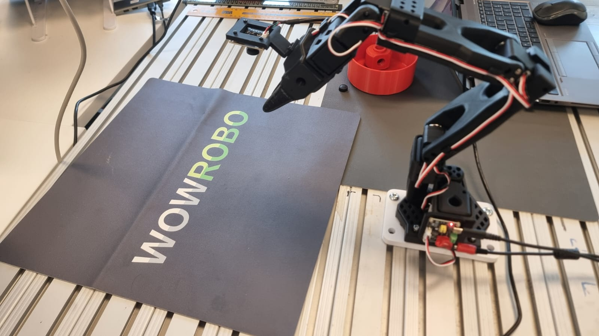

Getting Started
===============

Prerequisites
---------------------

- A prepared Lerobot SO101 leader + follower kit with calibration files.
  Follow the `setup guide <./setup.html>`_ to prepare the hardware and Python
  environment.
- A built ROS 2 workspace with ``so101_ros2`` and its dependencies installed.
  Follow the `build instructions <./build.html>`_ to set up the workspace.

Bridge configuration
--------------------
Update the leader and follower parameter files in
``so101_ros2_bridge/config`` so they reference the detected USB ports,
calibration directory, and Lerobot identifiers::

   so101_ros2_bridge/config/so101_leader_params.yaml
   so101_ros2_bridge/config/so101_follower_params.yaml

For example, the follower configuration may look like this:

.. code-block:: yaml

   so101_follower_ros2_bridge:
     ros__parameters:
       port: <your follower robot USB port>
       id: <your follower robot ID>
       calibration_dir: "/abs/path/to/calibration"  # Optional. If omitted, falls back to config/calibration/
       use_degrees: true
       max_relative_target: 10
       disable_torque_on_disconnect: true
       publish_rate: 30.0

Each file exposes the ``port``, ``id`` and ``publish_rate`` fields that the
Python bridge nodes consume. The follower configuration also provides
``max_relative_target`` and ``disable_torque_on_disconnect`` to bound the
commands sent to the hardware. Set ``calibration_dir`` to the location where you
stored the JSON calibration files generated during the Lerobot setup.

Camera configuration
--------------------
Camera launch parameters live in ``so101_bringup/config/so101_cameras.yaml``. The
file lists the cameras to start, their namespaces, and the specific parameter
files to load. For example:

.. code-block:: yaml

   cameras:
     - name: cam_front
       camera_type: usb_camera
       param_path: so101_usb_cam.yaml
       namespace: follower

The referenced USB camera configuration declares the per-device settings, including specific parameters and shared parameters across all cameras (of the camera_type). For example:

.. code-block:: yaml

   # so101_usb_cam.yaml
   ## Shared parameters for all USB cameras
   /**:
   ros__parameters:
      framerate: 30.0
      io_method: "mmap"
      pixel_format: "mjpeg2rgb"
      av_device_format: "YUV422P"
      image_width: 640
      image_height: 480
      # Other shared parameters can be added here

   ## Per-camera parameters under
   #/<namespace>/<name>
   /follower/cam_front:
     ros__parameters:
       video_device: "<your camera device path, e.g. /dev/video4>"
       frame_id: "cam_front"
       camera_name: "cam_front"
       camera_info_url: "package://usb_cam/config/camera_info.yaml"

Launch the system
-----------------
Source the workspace and launch the teleoperation pipeline with cameras and RViz enabled::

   ros2 launch so101_bringup so101_robot_with_cameras.launch.py display:=true

Manipulate the follower arm to verify that the robot model in RViz follows the
real hardware and that the camera streams are visible.

.. image:: ../media/images/getting_started.png
   :alt: SO101 robot with cameras in RViz

